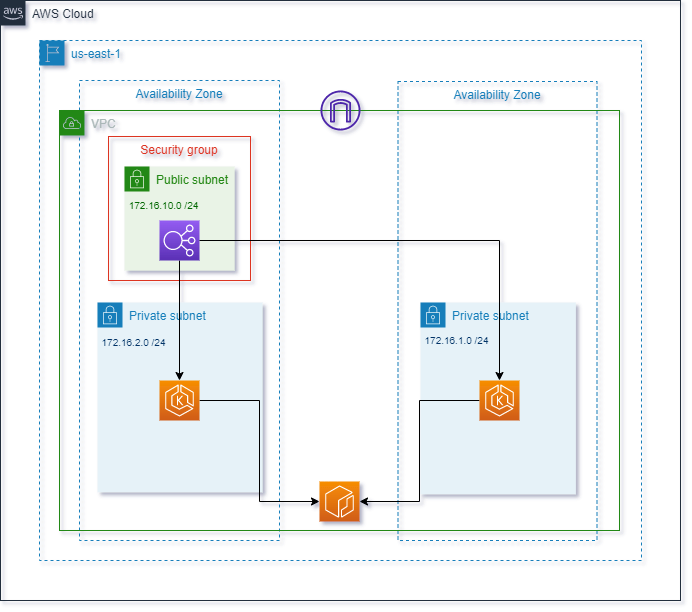

<p align="center">

</p>


> **⚠ ATTENTION: Apache Log4j 2 advisory.**  
> Due to [vulnerabilities](https://cloud.google.com/log4j2-security-advisory) present in earlier versions
> of Log4j 2, we have taken down all affected container images. We highly recommend all demos and forks to now
> use images from releases [>= v0.3.4](https://github.com/GoogleCloudPlatform/microservices-demo/releases).

**Online Boutique** is a cloud-native microservices demo application.
Online Boutique consists of a 10-tier microservices application. The application is a
web-based e-commerce app where users can browse items,
add them to the cart, and purchase them.


## Screenshots

| Home Page                                                                                                         | Checkout Screen                                                                                                    |
| ----------------------------------------------------------------------------------------------------------------- | ------------------------------------------------------------------------------------------------------------------ |
| [](./docs/img/online-boutique-frontend-1.png) | [](./docs/img/online-boutique-frontend-2.png) |

## Architecture

**Online Boutique** is composed of 11 microservices written in different
languages that talk to each other over gRPC. See the [Development Principles](/docs/development-principles.md) doc for more information.

[](./docs/img/architecture-diagram.png)

Find **Protocol Buffers Descriptions** at the [`./pb` directory](./pb).

| Service                                              | Language      | Description                                                                                                                       |
| ---------------------------------------------------- | ------------- | --------------------------------------------------------------------------------------------------------------------------------- |
| [frontend](./src/frontend)                           | Go            | Exposes an HTTP server to serve the website. Does not require signup/login and generates session IDs for all users automatically. |
| [cartservice](./src/cartservice)                     | C#            | Stores the items in the user's shopping cart in Redis and retrieves it.                                                           |
| [productcatalogservice](./src/productcatalogservice) | Go            | Provides the list of products from a JSON file and ability to search products and get individual products.                        |
| [currencyservice](./src/currencyservice)             | Node.js       | Converts one money amount to another currency. Uses real values fetched from European Central Bank. It's the highest QPS service. |
| [paymentservice](./src/paymentservice)               | Node.js       | Charges the given credit card info (mock) with the given amount and returns a transaction ID.                                     |
| [shippingservice](./src/shippingservice)             | Go            | Gives shipping cost estimates based on the shopping cart. Ships items to the given address (mock)                                 |
| [emailservice](./src/emailservice)                   | Python        | Sends users an order confirmation email (mock).                                                                                   |
| [checkoutservice](./src/checkoutservice)             | Go            | Retrieves user cart, prepares order and orchestrates the payment, shipping and the email notification.                            |
| [recommendationservice](./src/recommendationservice) | Python        | Recommends other products based on what's given in the cart.                                                                      |
| [adservice](./src/adservice)                         | Java          | Provides text ads based on given context words.                                                                                   |
| [loadgenerator](./src/loadgenerator)                 | Python/Locust | Continuously sends requests imitating realistic user shopping flows to the frontend.                                              |
| [redis](./src/redis)                 | Redis | Cache database.                                              |


# Implementación de Soluciones Cloud 
### Obligatorio 2022 

## Comenzando 🚀

Somos la consultora BitBeat y hemos sido contratados para modernizar y desplegar la arquitectura e infraestructura de una aplicación que actualmente corre en un datacenter on-premise llamada Online Bouteque con el objetivo de expandir sus operaciones por todo el mundo, haciendo llegar sus servicios de e-commerce y retail, a todo el continente de América.

....Basado en una arquitectura de microservicios para correr sobre containers cuyo ciclo de integración continua ya se encuentra configurado y la solución ya se encuentra disponible para desplegar por parte del equipo de DevOps.


## Pre-requisitos 📋

- [x] Terraform
- [x] Git
- [X] Aws cli
- [x] Docker
- [x] Kubernetes
- [x] Terminal Linux  (se sugiere usar un editor de código fuente en caso de querer realizar modificaciones).

### Herramientas 🛠️

- GitHub
- AWS
- GO
- Java
- Pyhton
- Node.js


## Código de la infraestructura automatizada 

**_Los archivos con el código automatizado en terraform se encuentran en el directorio_** **terraform** at [`./terraform`](./terraform).


| Archivo                                              | Descripción                                                                                                                      |
| ----------------------------------------------------  | ---------------------------------------------------------------------------------- |
| [data](./terraform/data.tf)                           | Carga de datos que se utilizaran luego en el código |
| [eks](./terraform/eks.tf)                             | Configuración de K8s |
| [local](./terraform/locals.tf)                        | Variables locales donde se definen nombres y URL's|
| [network](./terraform/network.tf)                     | Configuración de la VPC y todos sus componentes |
| [output](./terraform/output.tf)                       | Informacion devuelta luego de la ejecución |
| [provider](./terraform/provider.tf)                   | Providers de AWS y Docker |
| [registry](./terraform/registry.tf)                   | Genera imágenes y las sube al repositorio ECR |
| [security-groups](./terraform/security-groups.tf)     | Grupos de seguridad definidos |
| [variables](./terraform/variables.tf)                 | Variables utilizadas |


**_Los archivos con el código automatizado en bash se encuentran en el directorio_** **scripts** at [`./scripts`](./scripts).

| Archivo                                              | Descripción                                                                                                                      |
| ----------------------------------------------------  | ---------------------------------------------------------------------------------- |
| [eks](./scripts/eks.sh)                     | Scripts de creación de namespaces, deployment y obtención de la URL del servicio |


## Diagrama de arquitectura completo




### Arquitectura

Creamos dentro de una región dos zonas de disponibilidad para tener redundancia y alta disponibilidad con dos cluster de kubernetes, un load balancer para cargar bien las aplicaciones, y dos subnets privadas. 

## Datos de la infraestructura 


## Servicios de AWS

- VPC - Amazon Virtual Private Cloud 
- ELB – Elastic Load balancer
- EKS - Kubernetes 
- ECR - registry


## Despliegue 📦

**Despliegue de terraform**

```
cd ~/terraform
terraform init
terraform plan -out "plan.out" 
terraform apply "plan.out"

```


**Generar nodos en AWS**

Se debe dirigir al aks creado en terraform y crear un node group para el cluster.


**Ejecución de bash**

```
cd ../scripts
./eks.sh -c clustername -n namespace

```

## Referencias bibliográficas 📚
-	https://guides.github.com/features/mastering-markdown/
-	https://gist.github.com/Villanuevand/6386899f70346d4580c723232524d35a

## Autores ✒️
- **Rodrigo Santomuro** - *Trabajo y documentacion* - [@rsantomauro](https://github.com/rsantomauro)
- **Virginia Grajales** - *Trabajo y documentación* - [@vikygj](https://github.com/vikygj)
- **Juan Ignacio Tabárez** - *Trabajo y documentación* - [@itabarez](https://github.com/itabarez)


