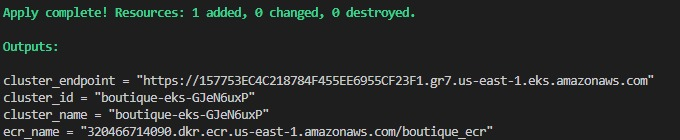
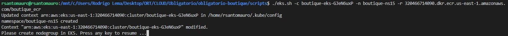

<p align="center">

</p>


> **⚠ ATTENTION: Apache Log4j 2 advisory.**  
> Due to [vulnerabilities](https://cloud.google.com/log4j2-security-advisory) present in earlier versions
> of Log4j 2, we have taken down all affected container images. We highly recommend all demos and forks to now
> use images from releases [>= v0.3.4](https://github.com/GoogleCloudPlatform/microservices-demo/releases).

**Online Boutique** is a cloud-native microservices demo application.
Online Boutique consists of a 10-tier microservices application. The application is a
web-based e-commerce app where users can browse items,
add them to the cart, and purchase them.


## Screenshots

| Home Page                                                                                                         | Checkout Screen                                                                                                    |
| ----------------------------------------------------------------------------------------------------------------- | ------------------------------------------------------------------------------------------------------------------ |
| [](./docs/img/online-boutique-frontend-1.png) | [](./docs/img/online-boutique-frontend-2.png) |

## Architecture

**Online Boutique** is composed of 11 microservices written in different
languages that talk to each other over gRPC. See the [Development Principles](/docs/development-principles.md) doc for more information.

[](./docs/img/architecture-diagram.png)

Find **Protocol Buffers Descriptions** at the [`./pb` directory](./pb).

| Service                                              | Language      | Description                                                                                                                       |
| ---------------------------------------------------- | ------------- | --------------------------------------------------------------------------------------------------------------------------------- |
| [frontend](./src/frontend)                           | Go            | Exposes an HTTP server to serve the website. Does not require signup/login and generates session IDs for all users automatically. |
| [cartservice](./src/cartservice)                     | C#            | Stores the items in the user's shopping cart in Redis and retrieves it.                                                           |
| [productcatalogservice](./src/productcatalogservice) | Go            | Provides the list of products from a JSON file and ability to search products and get individual products.                        |
| [currencyservice](./src/currencyservice)             | Node.js       | Converts one money amount to another currency. Uses real values fetched from European Central Bank. It's the highest QPS service. |
| [paymentservice](./src/paymentservice)               | Node.js       | Charges the given credit card info (mock) with the given amount and returns a transaction ID.                                     |
| [shippingservice](./src/shippingservice)             | Go            | Gives shipping cost estimates based on the shopping cart. Ships items to the given address (mock)                                 |
| [emailservice](./src/emailservice)                   | Python        | Sends users an order confirmation email (mock).                                                                                   |
| [checkoutservice](./src/checkoutservice)             | Go            | Retrieves user cart, prepares order and orchestrates the payment, shipping and the email notification.                            |
| [recommendationservice](./src/recommendationservice) | Python        | Recommends other products based on what's given in the cart.                                                                      |
| [adservice](./src/adservice)                         | Java          | Provides text ads based on given context words.                                                                                   |
| [loadgenerator](./src/loadgenerator)                 | Python/Locust | Continuously sends requests imitating realistic user shopping flows to the frontend.                                              |
| [redis](./src/redis)                 | Redis | Cache database.                                              |


# Implementación de Soluciones Cloud 
### Obligatorio 2022 

## Comenzando 🚀

Somos la consultora BitBeat y hemos sido contratados para modernizar y desplegar la arquitectura e infraestructura de una aplicación que actualmente corre en un datacenter on-premise llamada Online Bouteque con el objetivo de expandir sus operaciones por todo el mundo, haciendo llegar sus servicios de e-commerce y retail, a todo el continente de América.


## Pre-requisitos 📋

- [x] Terraform
- [x] Git
- [X] Aws cli
- [x] Docker
- [x] Kubectl
- [x] Terminal Linux (para ejecución de bash)

### Herramientas 🛠️

- GitHub
- AWS
- GO
- Java
- Pyhton
- Node.js

### Providers :truck:

- [Docker v2.15.0](https://registry.terraform.io/providers/kreuzwerker/docker/2.15.0/docs)
- [Kubernetes v2.0.1](https://registry.terraform.io/providers/hashicorp/kubernetes/2.0.1/docs) 
- [eks ~>18.0](https://registry.terraform.io/modules/terraform-aws-modules/eks/aws/18.0.0)


## Código de la infraestructura automatizada 

**_Los archivos con el código automatizado en terraform se encuentran en el directorio_** **terraform** at [`./terraform`](./terraform).


| Archivo                                              | Descripción                                                                                                                      |
| ----------------------------------------------------  | ---------------------------------------------------------------------------------- |
| [data](./terraform/data.tf)                           | Carga de datos que se utilizaran luego en el código |
| [eks](./terraform/eks.tf)                             | Configuración de K8s |
| [local](./terraform/locals.tf)                        | Variables locales donde se definen nombres y URL's|
| [network](./terraform/network.tf)                     | Configuración de la VPC y todos sus componentes |
| [output](./terraform/output.tf)                       | Informacion devuelta luego de la ejecución |
| [provider](./terraform/provider.tf)                   | Providers de AWS y Docker |
| [registry](./terraform/registry.tf)                   | Genera imágenes y las sube al repositorio ECR |
| [security-groups](./terraform/security-groups.tf)     | Grupos de seguridad definidos |
| [variables](./terraform/variables.tf)                 | Variables utilizadas |


**_Los archivos con el código automatizado en bash se encuentran en el directorio_** **scripts** at [`./scripts`](./scripts).

| Archivo                                              | Descripción                                                                                                                      |
| ----------------------------------------------------  | ---------------------------------------------------------------------------------- |
| [eks](./scripts/eks.sh)                     | Scripts de creación de namespaces, deployment y obtención de la URL del servicio |


## Diagrama de arquitectura completo


### Arquitectura :gear:

Creamos dentro de una región dos zonas de disponibilidad para tener redundancia y alta disponibilidad con dos cluster de kubernetes, un load balancer para cargar bien las aplicaciones, y dos subnets privadas. 

## Datos de la infraestructura 

| Grupo                                              | Puertos Habilitados            | Uso                                                                                                                |
| ----------------------------------------------------  | ----------------------------- | ----------------------------------------------------- |
| boutique_eks_sg   |  80    | Permite el acceso a los servicios de eks


## Servicios de AWS

- VPC - Amazon Virtual Private Cloud 
- EKS - Kubernetes 
- ECR - registry


## Despliegue 📦

1. Clonar repositorio 
```git clone https://github.com/rsantomauro/obligatorio-boutique```

2. Entrar a terraform, iniciarlo y ejecutar el plan.out

```
cd obligatorio-boutique/terraform
terraform init
terraform plan -out "plan.out" 
terraform apply "plan.out"
```
Esto generará el siguiente output:



3. Ejecución de bash
```
cd ../scripts
chmod 777 eks.sh
```

Para una correcta ejecución se debe tomar el resultado generado en el output del nombre del cluster y el ecr:
```
./eks.sh -c boutique-eks-GJeN6uxP -n boutique-ns -r 320466714090.dkr.ecr.us-east-1.amazonaws.com/boutique_ecr
```

La ejecución devolvera el siguiente resultado: 


4. Crear en el cluster de AWS el nodegroup

Se debe dirigir al **EKS** creado en terraform y crear un nodegroup para el cluster.


## Versiones 🧬

- WSL2 UBUNTU
- Docker v20.10.15
- Terraform v1.1.9
- Aws v2.4.27
- EKSCTL v0.102.0
- EKS Cluster v1.22


## Referencias bibliográficas 📚
-	https://guides.github.com/features/mastering-markdown/
-	https://gist.github.com/Villanuevand/6386899f70346d4580c723232524d35a
-	https://github.com/ikatyang/emoji-cheat-sheet/blob/master/README.md


## Autores ✒️
- **Rodrigo Santomuro** - *Trabajo y documentacion* - [@rsantomauro](https://github.com/rsantomauro)
- **Virginia Grajales** - *Trabajo y documentación* - [@vikygj](https://github.com/vikygj)
- **Juan Ignacio Tabárez** - *Trabajo y documentación* - [@itabarez](https://github.com/itabarez)


